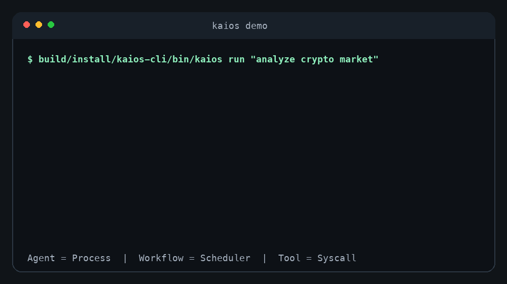
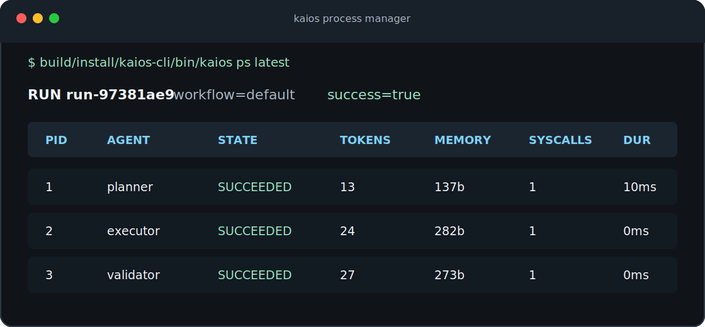

# KAI OS

> AI Agent Operating System in Kotlin.

[](LICENSE)
[](https://kotlinlang.org/)

Website: [morning-verlu.github.io/KAI](https://morning-verlu.github.io/KAI/)

KAI OS is a Kotlin runtime for orchestrating AI agents like operating-system processes.

It is not a chatbot framework, not a LangChain clone, and not just a CLI. The goal is a developer-native runtime where agents have lifecycle, memory, permissions, metrics, and syscall-style tool boundaries.





```text
Agent    = Process
Workflow = Scheduler
Tool     = Syscall
Memory   = Process state
```

## Use KAI OS When

- You want a no-key Agent Gate for CI before wiring real model providers.
- You need process-style observability for multi-agent work: PID, state, tokens, context, syscalls, duration, and lifecycle events.
- You want portable evidence artifacts for reviews and support: verify JSON, process traces, run capsules, offline replay, baseline diffs, and safe bug reports.
- You are building JVM/Kotlin agent infrastructure and want runtime boundaries before adding a UI, plugin system, or real provider.

KAI OS is intentionally small in v0.1. If you only need a chatbot UI or a thin prompt wrapper, this project is probably lower-level than you need.

## Why This Exists

Most agent frameworks model AI work as chains, prompts, or chat sessions. KAI OS models AI work as runtime infrastructure:

- Spawn agents as isolated processes.
- Track token usage like CPU.
- Track context size like memory.
- Track tool calls like IO/syscalls.
- Keep real network access behind explicit allowlist policy.
- Schedule multi-agent workflows as DAGs.
- Persist run snapshots for inspection and debugging.
- Emit KAI Process Trace JSON for CI, UI, replay, and audit tooling.
- Package runs as portable KAI Run Capsules with snapshots, traces, provenance hashes, and replay commands.
- Replay shared capsules offline by rebuilding traces from embedded snapshots.
- Diff two capsules offline for stable agent-run regression checks.
- Create one-command evidence bundles for CI by packaging, validating, replaying, and optionally diffing a run.

Kotlin gives this model a strong foundation: JVM ecosystem reach, type safety, coroutines-ready concurrency, DSL ergonomics, and a path toward Kotlin Multiplatform.

## Quick Start

Install, then run the full no-key onboarding gate:

```bash
brew tap morning-verlu/tap
brew install kaios

kaios quickstart
```

`kaios quickstart` runs the deterministic demo, creates a validated `kaios.json`, writes a no-key GitHub Actions Agent Gate, verifies the workflow, writes a portable evidence capsule, and prints the next command to inspect the agent processes. It is safe to rerun: existing config and CI files are kept unless you pass `--force`.
Use `kaios quickstart --no-ci` when you want the same local onboarding path without writing `.github/workflows/kaios.yml`.
When you do keep the generated workflow, pushing it to GitHub may require an account token or session with workflow permission.

Prefer the manual path when you want to see each step:

```bash
kaios demo
kaios setup --ci
kaios gate
```

`kaios setup --ci` creates a validated `kaios.json` and a no-key GitHub Actions Agent Gate without overwriting existing files. The setup output names the uploaded `kaios-agent-gate` artifact and its evidence files so CI failures are easy to inspect.
`kaios gate` checks the local runtime, validates the workflow, runs a deterministic mock smoke workflow, validates the process trace contract, leaves a normal run snapshot for `ps`, `inspect`, and `trace`, writes a portable proof package at `artifacts/kaios-run.capsule.json`, and can append a PR-visible Markdown summary with `--summary-out "$GITHUB_STEP_SUMMARY"`. It is the short product path for `kaios verify --evidence --force`.

When the gate is ready, create a project artifact:

```bash
kaios run --index . --context README.md --out artifacts/project.md --trace-out artifacts/trace.json --force "summarize this project"
```

If the project does not have `README.md`, omit `--context README.md`. KAI OS still uses the Workspace Index to orient the run.

Every command has local examples when you need the next move without opening docs:

```bash
kaios
kaios help quickstart
kaios help demo
kaios help gate
kaios help verify
kaios help run
kaios help analyze
kaios help config
kaios help config show
```

Common aliases also work directly: `kaios start --no-ci` for local quickstart, `kaios status` for doctor, `kaios ls` for saved runs, `kaios proc` for the process table, and `kaios audit` for evidence packaging. If you truly mistype a command, KAI OS suggests the closest safe next command instead of guessing.
After a saved run exists, inspection commands default to the newest run: `kaios ps`, `kaios inspect`, `kaios trace --check`, `kaios evidence --out artifacts/run.capsule.json --force`, `kaios report`, and `kaios export` all work without typing `latest`.

Need a support-friendly environment check?

```bash
kaios doctor
kaios doctor --json
kaios bug-report
kaios doctor --config workflows/research.json --json
kaios bug-report --config workflows/research.json --out artifacts/kaios-bug-report.md --force
```

`kaios bug-report` creates a safe-to-paste Markdown report with doctor checks, config validation, latest run metrics, and trace contract status.
`kaios doctor`, `kaios gate`, `kaios verify`, and `kaios bug-report` print the same recovery path: `kaios quickstart` for the full no-key onboarding gate, `kaios setup --ci` when no project workflow exists, `kaios gate --config kaios.json` when one is valid, or `kaios config validate --config kaios.json --json` plus `kaios setup --ci --force` when an existing config is invalid.
Use `--config` with `doctor` and `bug-report` when your project workflow lives outside the default `kaios.json`; diagnostics and next commands will follow that exact file instead of falling back to the default.

Need a machine-readable workspace report for CI or dashboards?

```bash
kaios analyze . --format json --out artifacts/analysis.json --force
```

Need the run itself as a machine-readable process trace?

```bash
kaios runs --json
kaios run --index . --trace-out artifacts/trace.json --force "summarize this project"
```

Need a portable audit package for CI, review, or future Agent Desktop imports?

```bash
kaios gate --config kaios.json
kaios gate --config kaios.json --baseline artifacts/baseline.capsule.json --check
```

Need to package the latest non-verify run instead?

```bash
kaios evidence --out artifacts/run.capsule.json --force
kaios evidence --out artifacts/run.capsule.json --baseline artifacts/baseline.capsule.json --check --force
```

The evidence gate writes a portable capsule, validates its contract, replays it offline, and can add a stable baseline diff that exits non-zero when behavior changes.

The lower-level capsule tools remain available when you need each step separately:

```bash
kaios capsule --check
kaios replay --file artifacts/run.capsule.json
kaios diff artifacts/baseline.capsule.json artifacts/run.capsule.json --check
```

Create a local workflow config when you want your own agent process graph:

```bash
kaios setup --ci
kaios config show
kaios config validate --json
kaios gate
kaios run --out artifacts/runtime.md "map the JVM agent runtime"
```

`kaios setup --ci` also writes `.github/workflows/kaios.yml`, a no-key Agent Gate that installs KAI OS, runs `kaios gate --config kaios.json --summary-out "$GITHUB_STEP_SUMMARY" --json`, saves the verify JSON plus capsule artifact, appends a PR-visible Markdown summary with Verdict, Why It Failed, and Fix First sections, and collects a JSON bug report when the gate fails.

Or install with the hosted script:

```bash
curl -fsSL https://morning-verlu.github.io/KAI/install.sh | sh
export PATH="$HOME/.kaios/bin:$PATH"
kaios quickstart
```

Or build from source:

```bash
./gradlew test installDist
build/install/kaios-cli/bin/kaios quickstart
build/install/kaios-cli/bin/kaios analyze . --out artifacts/analysis.md --force
build/install/kaios-cli/bin/kaios run --index . --context README.md --out artifacts/project.md --trace-out artifacts/trace.json --force "summarize this project"
```

Example output:

```text
run_id: run-97381ae9
success: true
snapshot: .kaios/runs/run-97381ae9.json

validate:350c4677 accepted result from after executor
syscall echo: validated:350c4677
```

Inspect the agent process table:

```bash
kaios ps
```

```text
RUN run-97381ae9  workflow=default  success=true
PID     AGENT         STATE       TOKENS    MEMORY    SYSCALLS  DURATION
1       planner       SUCCEEDED   13        137b      1         10ms
2       executor      SUCCEEDED   24        282b      1         0ms
3       validator     SUCCEEDED   27        273b      1         0ms
```

Inspect lifecycle events:

```bash
kaios inspect
```

Print the KAI Process Trace:

```bash
kaios trace
kaios trace --json
kaios trace --check
kaios trace --json --out artifacts/trace.json --force
```

```text
KAI PROCESS TRACE
schema: kaios.process-trace/v1
run: run-97381ae9
workflow: default
success: true

path:
  <input> -> planner(pid=1) -> executor(pid=2) -> validator(pid=3)
```

Generate a standalone Agent Process Manager report:

```bash
kaios report
```

Package the run as a portable KAI Run Capsule:

```bash
kaios evidence --out artifacts/run.capsule.json --force
kaios evidence --out artifacts/run.capsule.json --baseline artifacts/baseline.capsule.json --check --force
```

Export a Markdown artifact:

```bash
kaios export
```

Use the literal run id when you need to pin an audit trail; omit it when you are iterating on the newest local run.

Attach local context files or directories:

```bash
kaios analyze . --out artifacts/analysis.md --force
kaios analyze . --format json --out artifacts/analysis.json --force
kaios index .
kaios context README.md docs
kaios run --index . --context README.md --context docs "explain the architecture"
```

KAI OS can generate a deterministic workspace analysis report before any model call, then build a Workspace Index before a run. The report and index summarize language distribution, top directories, notable files, source/test shape, quality signals, and suggested next KAI OS commands without dumping full file contents into artifacts. It also reads bounded context files inside the current workspace, skips generated/runtime directories such as `.git`, `.kaios`, `artifacts`, `build`, and `node_modules`, enforces size limits, and records source summaries in snapshots and artifacts. Add a `.kaiosignore` file to exclude extra paths before they reach an agent process:

```gitignore
secrets/
*.local.md
```

## Architecture

```text
                CLI / API / UI
                      |
                Agent Runtime
          lifecycle | memory | context
                      |
      +---------------+---------------+
      |               |               |
  Scheduler       Tool System     Memory Layer
  DAG engine      syscalls        run state
```

Modules:

- `runtime-core`: process lifecycle, scheduler, events, model abstraction, DSL.
- `tool-runtime`: built-in syscall tools including allowlisted HTTP and scoped files.
- `memory-engine`: in-memory session memory and JSON run snapshots.
- `model-providers`: OpenAI-compatible and Ollama model provider implementations.
- `kaios-cli`: `kaios quickstart`, `kaios gate`, `kaios demo`, `kaios init`, `kaios run`, `kaios runs`, `kaios ps`, `kaios inspect`, `kaios trace`, `kaios capsule`, `kaios replay`, `kaios diff`, `kaios report`, workspace analysis, Workspace Index, context-file loading, and `kaios doctor`.

Read the deeper design notes in [docs/ARCHITECTURE.md](docs/ARCHITECTURE.md).
Read the JSON automation contracts in [docs/JSON_CONTRACTS.md](docs/JSON_CONTRACTS.md).
Read the trace schema contract in [docs/TRACE.md](docs/TRACE.md).
Read the capsule schema contract in [docs/CAPSULE.md](docs/CAPSULE.md).

## Kotlin DSL

```kotlin
val planner = agent("planner") {
    instruction("Plan the task as an agent process.")
    tool("echo")
    tool("clock")
    memory(sessionMemory)
}

val defaultWorkflow = workflow("default") {
    node("planner", planner)
    node("executor", agent("executor") { tool("mock-http") }).dependsOn("planner")
    node("validator", agent("validator") { tool("echo") }).dependsOn("executor")
}
```

See [examples/README.md](examples/README.md) for runnable CLI examples and the current v0.1 behavior.

## Project Config

Use `kaios init` to generate `kaios.json`, then edit the agent DAG without recompiling Kotlin. Add `--ci` when you also want the official GitHub Actions Agent Gate. Built-in templates include `default`, `research`, `code-review`, and `release`.

```json
{
  "name": "custom-research",
  "agents": [
    {
      "id": "researcher",
      "instruction": "Gather useful context for the task.",
      "tools": ["echo", "clock"]
    },
    {
      "id": "writer",
      "instruction": "Write a concise answer.",
      "tools": ["echo"],
      "dependsOn": ["researcher"]
    },
    {
      "id": "validator",
      "instruction": "Check the answer and mark it accepted.",
      "tools": ["echo"],
      "dependsOn": ["writer"]
    }
  ]
}
```

Run it with:

```bash
kaios config validate
kaios config show
kaios run "map the JVM agent runtime"
```

Generate the production-ready gate with:

```bash
kaios init --template research --ci
git add kaios.json .github/workflows/kaios.yml
```

When `kaios.json` exists in the current directory, `kaios run "task"` uses it automatically. Use `kaios run --default "task"` to force the built-in workflow, or `kaios run --config path/to/workflow.json "task"` for a specific file.

See [docs/CONFIG.md](docs/CONFIG.md) for templates, config fields, validation rules, built-in tools, and fallback routing.

For launch posts, demos, and community announcements, see [docs/LAUNCH_KIT.md](docs/LAUNCH_KIT.md).

For real model execution, see [docs/PROVIDERS.md](docs/PROVIDERS.md).

For built-in syscall tools, see [docs/TOOLS.md](docs/TOOLS.md).

For one-command project setup, see [docs/SETUP.md](docs/SETUP.md).

For the no-key readiness gate, see [docs/VERIFY.md](docs/VERIFY.md).

For copyable project examples, including the default GitHub Actions Agent Gate, see [examples/README.md](examples/README.md).

For persisted memory, see [docs/MEMORY.md](docs/MEMORY.md).

For Workspace Index and project context, see [docs/INDEX.md](docs/INDEX.md).

For issue diagnostics and safe bug reports, see [docs/SUPPORT.md](docs/SUPPORT.md).

For all install options, see [docs/INSTALL.md](docs/INSTALL.md).

## Current Status

KAI OS is early v0.1 infrastructure. Today it includes:

- Deterministic `MockModelProvider`, no API key needed.
- OpenAI-compatible and Ollama providers for real model execution.
- Real providers can request tools through `KAIOS_SYSCALL` directives.
- Agent lifecycle: spawn, start, suspend, resume, cancel, succeed, fail.
- Process metrics: PID, state, token usage, context size, syscall count, duration.
- Coroutine-based DAG scheduler with parallel-ready nodes, observable retry policy, fallback routing, timeout policy, and sibling cancellation.
- Permissioned tools: `echo`, `clock`, `mock-http`, allowlisted `http`, scoped `file`.
- Project workflow templates, retry policy, config validation, config graph display, and auto-detected `kaios.json` runs.
- `kaios setup` bootstraps a validated project workflow and can add the CI Agent Gate in one command.
- Default GitHub Actions Agent Gate with PR-visible Markdown summary, verify JSON, evidence capsule, and failure-time bug report.
- `kaios gate` runs the product Agent Gate: readiness checks, trace validation, evidence capsule, offline replay, and optional baseline diff.
- `kaios verify` emits `kaios.verify/v1`, runs the no-key readiness gate, can write `kaios.evidence/v1`, and saves a normal run snapshot for inspection.
- `kaios config validate --json` emits `kaios.config-validation/v1` with `next` commands and structured `nextActions` for CI and release gates.
- `kaios init --ci` writes a GitHub Actions Agent Gate that uses the same local `kaios gate --config kaios.json` contract and stores machine-readable artifacts for automation.
- Deterministic workspace analysis with `kaios analyze` for no-key Markdown and JSON project reports.
- Workspace Index with `kaios index` and `kaios run --index <path>` for language stats, notable files, and project source maps.
- Project-aware runs with `kaios context`, `.kaiosignore`, and bounded `kaios run --context <file-or-dir>` ingestion.
- Session memory and JSON snapshots under `.kaios/runs/`.
- SQLite memory adapter for persisted agent process memory.
- No-key `kaios quickstart` that runs demo, setup, verify, evidence, and prints the process inspection path.
- No-key `kaios demo` that prints the process table and writes a trace artifact.
- CLI process table, run registry, and run inspector.
- KAI Process Trace schema with text and JSON output through `kaios trace`.
- KAI Run Capsule schema with snapshot, trace, provenance hashes, replay commands, and validation status through `kaios capsule`.
- Offline Capsule Replay schema with deterministic trace rebuild checks through `kaios replay`.
- Offline Capsule Diff schema with stable runtime signature comparison through `kaios diff`.
- KAI Evidence schema with one-command package, validation, replay, and optional baseline diff through `kaios evidence`.
- `kaios runs --json` emits `kaios.runs/v1` for Agent Desktop, CI, and local tooling.
- Markdown run artifacts with `kaios run --out` and `kaios export`.
- `kaios doctor` and `kaios doctor --json` environment diagnostics for Java, provider, memory, snapshots, and writable runtime directories.
- `kaios bug-report` emits safe Markdown or `kaios.bug-report/v1` JSON for GitHub issues and team handoff.
- Static Agent Process Manager HTML reports under `.kaios/reports/`.
- README-ready terminal process preview for launch sharing.
- CLI demo GIF for README, launch site, and social posts.

Next milestones are tracked in [ROADMAP.md](ROADMAP.md).

## Development

Requirements:

- Java 17+
- No global Gradle install required

Commands:

```bash
./gradlew clean test installDist
scripts/quickstart-smoke.sh
build/install/kaios-cli/bin/kaios run "draft a launch plan"
scripts/demo.sh "analyze crypto market"
```

## Contributing

KAI OS is designed for people who want agent infrastructure to feel like systems programming again. Contributions are welcome around runtime design, scheduler behavior, tool isolation, model providers, memory adapters, and the future visual process manager.

Start with [CONTRIBUTING.md](CONTRIBUTING.md).

## License

Apache-2.0. See [LICENSE](LICENSE).
