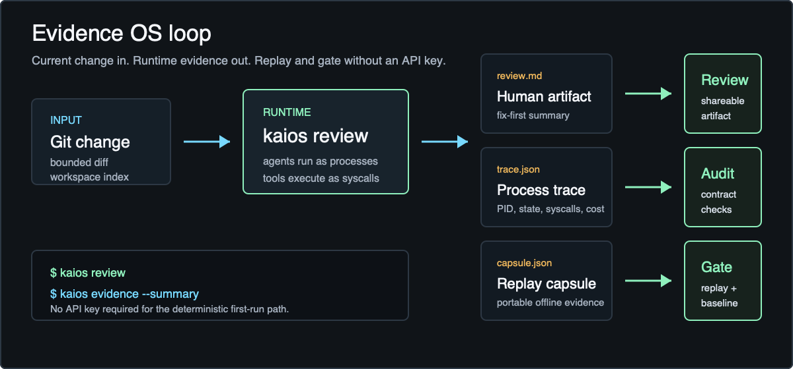

# Start Here

KAI OS is a local-first Evidence OS for AI agents in Kotlin.



It is for developers who want agent work to be inspectable like runtime infrastructure:

```text
Agent    = Process
Workflow = Scheduler
Tool     = Syscall
Memory   = Process state
```

## Choose Your First Path

### 1. Browser Only

Use this path when you do not want to install Java, Gradle, or the release ZIP locally.

1. Open [KAI OS in GitHub Codespaces](https://codespaces.new/morning-verlu/KAI?quickstart=1).
2. Wait for the dev container to finish.
3. Run:

```bash
./scripts/codespaces-smoke.sh
```

The smoke check builds the CLI, runs the no-key tour, validates a generated capsule, replays it offline, and checks the checked-in Evidence Sample.

### 2. Local CLI

Use this path when you want the installed `kaios` command on your machine.

```bash
curl -fsSL https://morning-verlu.github.io/KAI/install.sh | sh
export PATH="$HOME/.kaios/bin:$PATH"
kaios tour
```

`kaios tour` creates a disposable Git workspace, runs the Evidence OS loop, and prints the artifact paths to inspect next.

### 3. Artifact-Only Review

Use this path when you want to understand the product before running anything.

Open [examples/evidence-sample](examples/evidence-sample/) and inspect:

- `change-review.md`: the human review artifact.
- `change-review.trace.json`: the process trace contract.
- `change-review.capsule.json`: the replayable run capsule.
- `review-result.json`: the `kaios.review/v1` CLI/CI output.

## What To Look For

After a tour or review, KAI OS should leave you with:

- process rows for planner, executor, and validator agents.
- token, context, syscall, tool-time, and cost metrics.
- lifecycle events for each process.
- a syscall ledger for allowed or denied tool calls.
- a portable capsule that can be replayed offline.
- a baseline gate path for CI behavior drift.

## Real Project Path

Inside any Git repository:

```bash
kaios quickstart
kaios review
kaios ps
kaios evidence --summary
```

For a runnable Kotlin/JVM backend change, use [examples/jvm-service-review](examples/jvm-service-review/).

For a deterministic baseline gate that intentionally exits `1` on behavior drift, use [examples/baseline-gate](examples/baseline-gate/).

## Why This Is Different

KAI OS is not trying to be another chatbot framework or Kotlin LangChain clone.

The product surface is runtime evidence:

- process traces instead of opaque agent transcripts.
- capsules instead of machine-local run state.
- syscall audit records instead of unbounded tool access.
- offline replay instead of provider-only debugging.
- CI gates instead of manual trust.
